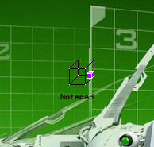



## Abhishek's Animating Desktop Icons

### Description

Displays Animating Icons On You Desktop.This Code Is Incomplete But Fairly Functional For Demonstration.I Shall Release The Complete Code In Next 2 Days
 
### More Info
 

             |
---                |---
**Submitted On**   |2005-04-24 17:46:02
**By**             |[Abhishek Kalsekar](https://github.com/Planet-Source-Code/PSCIndex/blob/master/ByAuthor/abhishek-kalsekar.md)
**Level**          |Advanced
**User Rating**    |3.7 (11 globes from 3 users)
**Compatibility**  |VB 4\.0 \(32\-bit\), VB 5\.0, VB 6\.0
**Category**       |[Miscellaneous](https://github.com/Planet-Source-Code/PSCIndex/blob/master/ByCategory/miscellaneous__1-1.md)
**World**          |[Visual Basic](https://github.com/Planet-Source-Code/PSCIndex/blob/master/ByWorld/visual-basic.md)
**Archive File**   |[Abhishek's1880734242005\.zip](https://github.com/Planet-Source-Code/abhishek-kalsekar-abhishek-s-animating-desktop-icons__1-60193/archive/master.zip)

